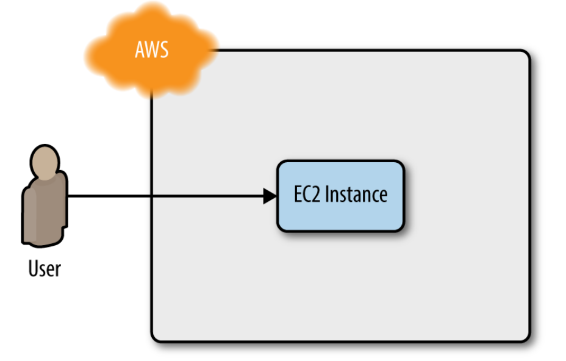
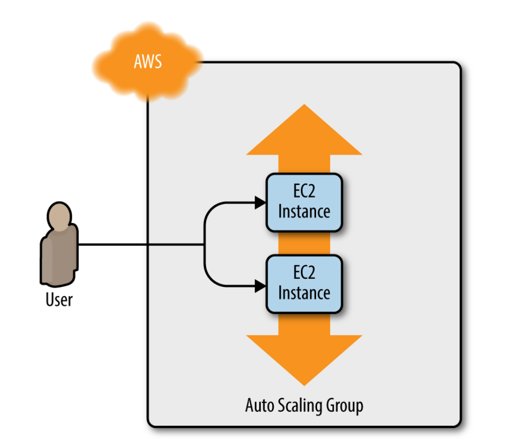

# Getting Started

Deploying a single server, then a web server, after this a cluster and finally a load balancer. In the end all the created infrastructure will be destroyed.

# 1. Single server deployment

# 2. Cluster of web server

